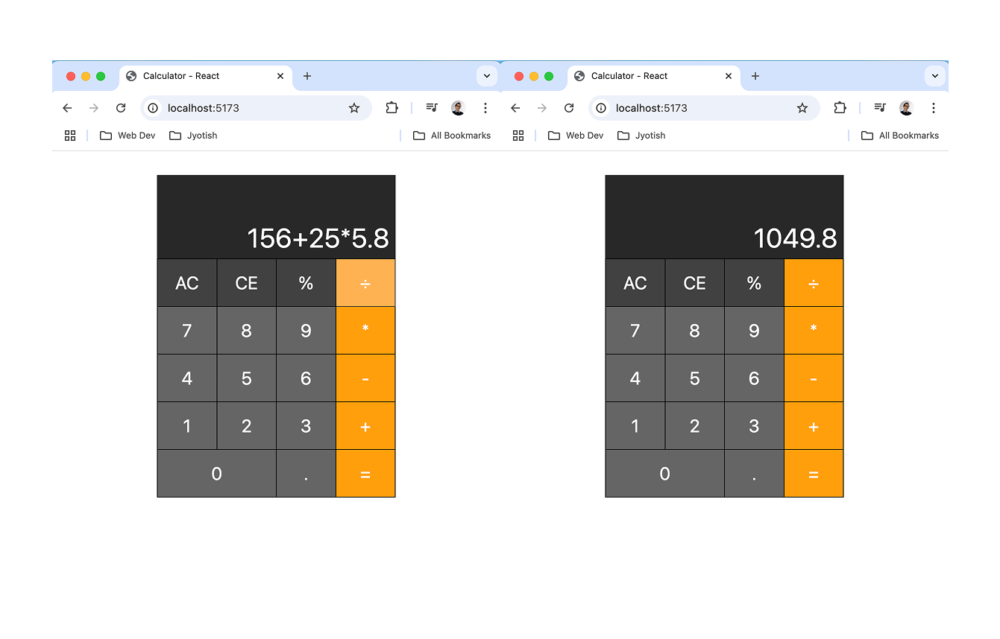

# 🧮 Calculator App

Calculator App built with React. Users sum, substract, multiply, divide and get the percent number of multiple operations including integers and decimal numbers. The app demonstrates fundamental React concepts like state management, component hierarchy, use of reducers and Context API for Communication.



## 🚀 Features

- ✅ Sum, Substract, Multiply, Divide and Percent. 
- ✅ Clic on numbers, add decimals, calculate result.
- ✅ Get the result of multiple operations.
- ❌ Delete numbers and operators.


## 🛠️ Tech Stack

- React
- Tailwind
- JavaScript

## 📦 Installation

Clone the repo and install dependencies:

```bash
git clone https://github.com/gianvallejos92/calculator-react
cd calculator-react
npm install
npm run dev